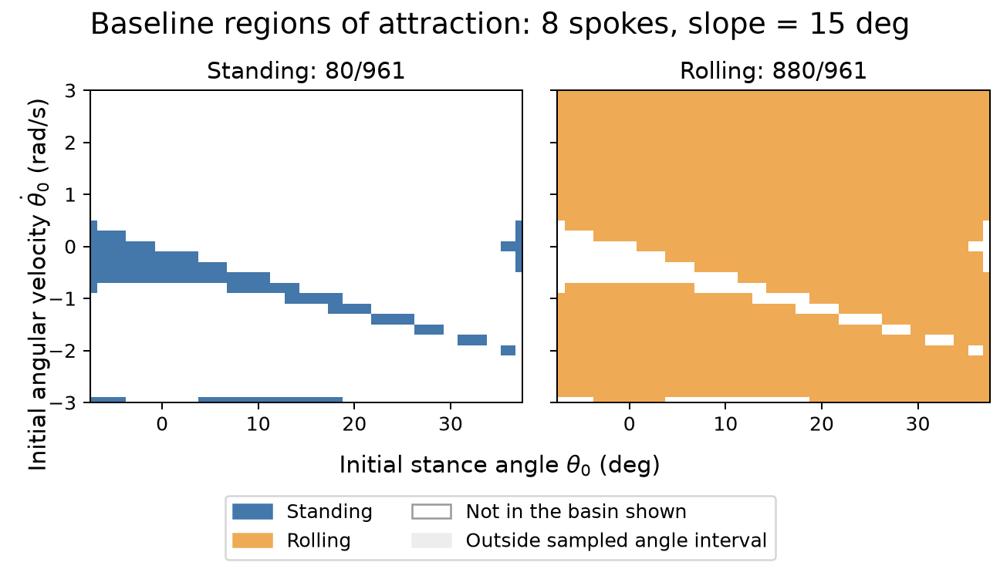
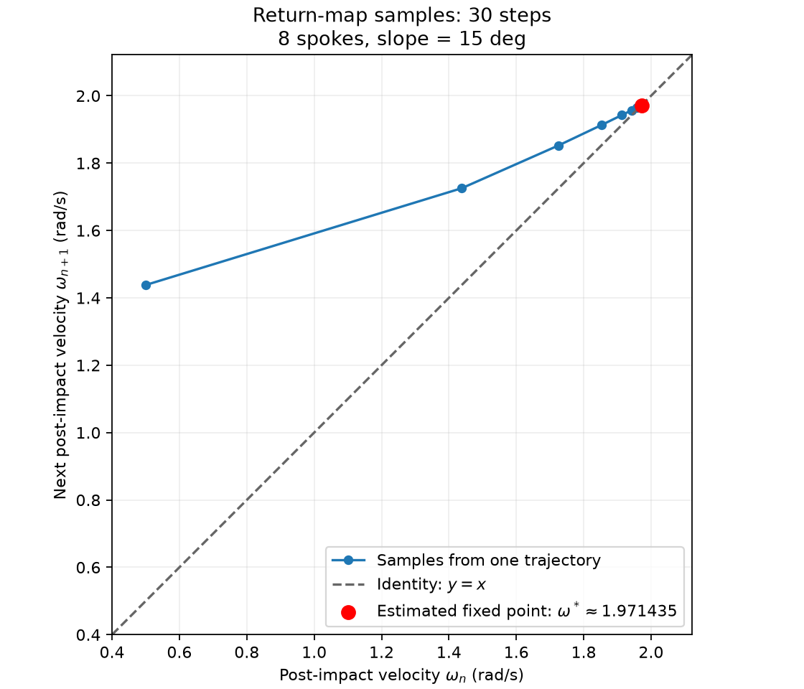
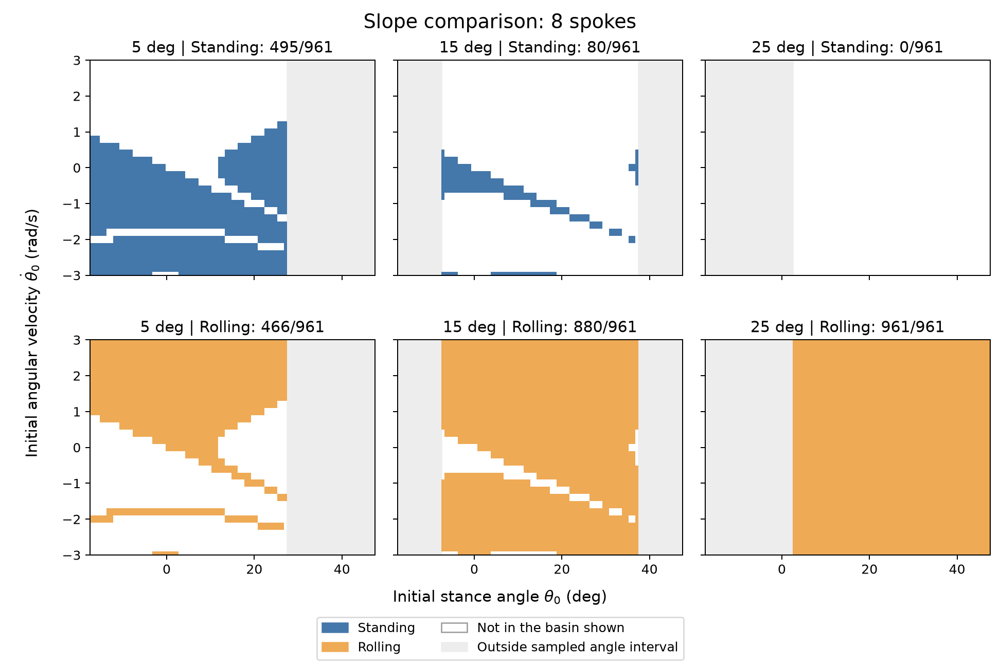
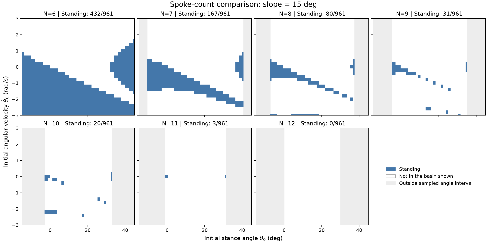
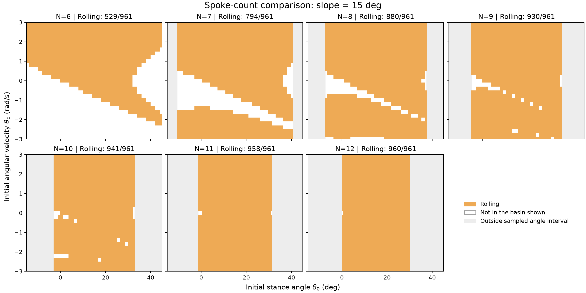
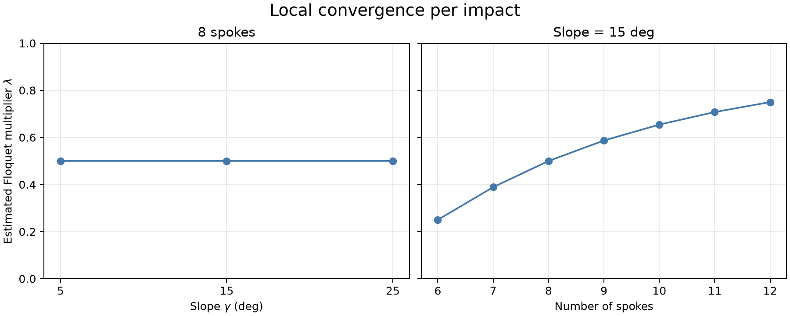

# Assignment 1 — Rimless Wheel

```bash
# Install dependencies.
uv sync --python 3.14

# Recreate the six report PNGs in assignments/assignment_1/figures/report_figures_<run>/.
uv run python assignments/assignment_1/plot_report_figures.py

# Show numerical sanity-check results alongside predictions and errors.
uv run python assignments/assignment_1/check_model.py

# Save angle and velocity versus time to assignments/assignment_1/figures/forward_trajectory.png.
uv run python assignments/assignment_1/simulate_wheel.py

# Save two RoA PNGs for a 31 × 31 initial-state grid.
uv run python assignments/assignment_1/analyze_roa.py

# Save the 30-step return-map PNG and estimate the Floquet multiplier.
uv run python assignments/assignment_1/analyze_return_map.py

# Save six RoA PNGs comparing slopes of 5°, 15°, and 25°.
uv run python assignments/assignment_1/sweep_slope.py

# Save fourteen RoA PNGs comparing 6–12 spokes at 15°.
uv run python assignments/assignment_1/sweep_spokes.py
```

## Report

### Model and numerical method

The wheel has a point mass $m$ at its hub and $N$ equally spaced, massless spokes of length $l$, with no slip at the stance foot. I use $g=9.81\ \mathrm{m/s^2}$, $m=1\ \mathrm{kg}$, and $l=1\ \mathrm{m}$; the baseline has $N=8$ and slope $\gamma=15^\circ$.

The state is $[\theta,\omega]$, with $\theta$ measured from the upward vertical, positive downhill, and $\omega=\dot\theta$. Let $\alpha=\pi/N$; a forward step starts at $\theta^+=\gamma-\alpha$ and ends at $\theta^-=\gamma+\alpha$.

Torque about the stance foot gives $ml^2\ddot\theta=mgl\sin\theta$, hence

$$
\dot\theta=\omega,\qquad \dot\omega=\frac{g}{l}\sin\theta.
$$

Contact occurs at $\theta^-$ while moving forward or at $\theta^+$ while moving backward. Angular momentum about the new foot is conserved during the plastic collision:

$$
ml^2\omega_{\mathrm{before}}\cos(2\alpha)=ml^2\omega_{\mathrm{after}}.
$$

For contact direction $d=\operatorname{sign}(\omega_{\mathrm{before}})$, the reset is

$$
\theta_{\mathrm{after}}=\theta_{\mathrm{before}}-2d\alpha,
\qquad
\omega_{\mathrm{after}}=\omega_{\mathrm{before}}\cos(2\alpha).
$$

The angle jump changes the stance-foot coordinates; the hub position stays continuous. Reverse contacts allow low-energy rocking to settle toward two-foot standing.

I integrate with RK4 at a maximum timestep of $0.01\ \mathrm{s}$ and locate contact by bisection to tolerances of $10^{-12}\ \mathrm{rad}$ and $10^{-12}\ \mathrm{s}$. Pre- and post-impact states share the same timestamp.

### Sanity checks

The three checks in [check_model.py](assignments/assignment_1/check_model.py) passed at the baseline parameters.

| Check | Expected behavior | Observed result |
| --- | --- | --- |
| State derivative | $[0,2]\mapsto[2,0]$ and $[\pi/6,0]\mapsto[0,4.905]$. | Both match within $10^{-12}$. |
| One continuous step | $E=\tfrac12ml^2\omega^2+mgl\cos\theta$ is constant; contact speed satisfies $\omega_{\mathrm{end}}^2=\omega_{\mathrm{start}}^2+\tfrac{2g}{l}(\cos\theta^+-\cos\theta^-)$. | Speed error decreases for timesteps $0.02,0.01,0.005\ \mathrm{s}$; at the finest step, speed and energy errors are below $10^{-8}\ \mathrm{rad/s}$ and $10^{-8}\ \mathrm{J}$. |
| Impact in either direction | At $N=8$, incoming $\omega=\pm2$ becomes $\pm\sqrt2$; kinetic energy halves and hub position remains continuous. | Reset, energy, and geometry checks pass. |

### Regions of attraction

The expected baseline attractors are two-foot standing and a rolling limit cycle.

I simulate a $31\times31$ grid over $\theta\in[\theta^+,\theta^-]$ and $\omega\in[-3,3]\ \mathrm{rad/s}$, allowing up to 30 impacts or 30 s per state. Classification uses:

- **Standing:** contact with two-foot support ($\theta^+<0<\theta^-$), $|\omega|\le10^{-4}\ \mathrm{rad/s}$, and insufficient energy to tip over either side; this approximates the limit of decaying rocking.
- **Rolling:** at the impact limit, the last six post-impact velocities are positive and all five successive changes are below $10^{-6}\ \mathrm{rad/s}$.
- Other states remain unresolved.

In all basin figures, blue denotes standing and orange rolling; white means outside the displayed basin, including unresolved points, and gray marks unsampled angles. Shared axes use the actual stance angle.



*Figure 1. At $N=8$, $\gamma=15^\circ$, the grid spans $-7.5^\circ$ to $37.5^\circ$: 80 initial states approach standing and 880 approach rolling. The remaining point, $(0,0)$, is the unstable upright equilibrium and stays unchanged until the time limit.*

### Contact return map and Floquet multiplier

On the section immediately after forward contact, $\theta=\theta^+$ is fixed, so the return map is scalar: $x_{n+1}=P(x_n)$ with $x_n=\omega_n^+$. Starting at $x_0=0.5\ \mathrm{rad/s}$, 30 impacts give 30 adjacent velocity pairs.



*Figure 2. Samples from one trajectory approach the identity line. The red circle marks the fixed-point estimate $x^*\approx1.971434911\ \mathrm{rad/s}$, taken from the final simulated velocity; the last change is $8.60\times10^{-10}\ \mathrm{rad/s}$.*

For a completed forward step, continuous energy conservation and the impact reset give

$$
(\omega_{n+1}^-)^2=x_n^2+D,\qquad
D=\frac{2g}{l}(\cos\theta^+-\cos\theta^-)
=\frac{4g}{l}\sin\gamma\sin\alpha,
$$

$$
P(x)=\cos(2\alpha)\sqrt{x^2+D}.
$$

Taylor expansion around the nonzero forward rolling fixed point $P(x^*)=x^*$ gives

$$
P(x^*+\delta x)=x^*+P'(x^*)\delta x+O(\delta x^2),
\qquad
\delta x_{n+1}\approx\lambda\,\delta x_n.
$$

$$
P'(x)=\frac{x\cos(2\alpha)}{\sqrt{x^2+D}}=\frac{x\cos^2(2\alpha)}{P(x)}
\quad\Longrightarrow\quad
\lambda=P'(x^*)=\cos^2(2\alpha)=\cos^2\left(\frac{2\pi}{N}\right).
$$

For the baseline $N=8$, the prediction is $\lambda=\cos^2(2\pi/8)=\cos^2(\pi/4)=0.5$.

Two perturbed one-impact simulations estimate the slope:

$$
\hat\lambda=
\frac{P(x^*+\varepsilon)-P(x^*-\varepsilon)}{2\varepsilon},
\qquad \varepsilon=0.01\ \mathrm{rad/s}.
$$

At the baseline, $\hat\lambda=0.499998$, agreeing with the prediction $0.5$: a small velocity error approximately halves per impact.

### Effect of slope

I compare $\gamma=5^\circ,15^\circ,25^\circ$ at $N=8$, retaining the grid, timestep, classification criteria, and 30-impact/30-s limits. Fixed-point trajectories start at $[\theta^+,2\ \mathrm{rad/s}]$; Floquet perturbations remain $\pm0.01\ \mathrm{rad/s}$.



*Figure 3. Columns show increasing slope; rows show standing and rolling.*

| Slope | Standing | Rolling | Unresolved | $x^*$ (rad/s) | $\hat\lambda$ |
| --- | --- | --- | --- | --- | --- |
| 5° | 495 | 466 | 0 | 1.144017 | 0.499995 |
| 15° | 80 | 880 | 1 | 1.971435 | 0.499998 |
| 25° | 0 | 961 | 0 | 2.519176 | 0.499999 |

Steeper slopes supply more gravitational energy per step: rolling speed and the rolling share of sampled states increase. At $25^\circ>\alpha=22.5^\circ$, stable two-foot standing is impossible. Local convergence remains approximately $0.5$ per impact, as predicted by the slope-independent $\lambda=\cos^2(2\alpha)$.

### Effect of spoke count

I compare $N=6,\ldots,12$ at $\gamma=15^\circ$, keeping the same grid size, velocity range, timestep, and perturbations. **The maximum number of impacts increases from 30 to 60, and the time limit from 30 to 60 s**, for both the grid and fixed-point trajectories; each Floquet perturbation still runs for one impact.

More spokes give a larger predicted $\lambda$ and slower convergence per impact. In the same saved $N=12$ trajectory, the maximum of the latest five velocity changes is $1.30\times10^{-4}\ \mathrm{rad/s}$ at impact 30 and $2.32\times10^{-8}\ \mathrm{rad/s}$ at impact 60; only the latter meets the unchanged $10^{-6}$ criterion. The longer time limit also accommodates slower trajectories, such as the $N=6$ fixed-point run taking $44.98\ \mathrm{s}$.



*Figure 4. Standing basins for 6–12 spokes; the basin disappears at $N=12$, where $\gamma=\alpha=15^\circ$.*



*Figure 5. Rolling basins in the same panel order; the sampled contact-angle interval narrows as $N$ increases.*

| Spokes | Standing | Rolling | Unresolved | $x^*$ (rad/s) | $\hat\lambda$ |
| --- | --- | --- | --- | --- | --- |
| 6 | 432 | 529 | 0 | 1.301029 | 0.249999 |
| 7 | 167 | 794 | 0 | 1.674039 | 0.388738 |
| 8 | 80 | 880 | 1 | 1.971435 | 0.499998 |
| 9 | 31 | 930 | 0 | 2.221135 | 0.586823 |
| 10 | 20 | 941 | 0 | 2.438332 | 0.654507 |
| 11 | 3 | 958 | 0 | 2.632081 | 0.707706 |
| 12 | 0 | 960 | 1 | 2.808157 | 0.749999 |

More spokes reduce the kinetic-energy loss per collision, increasing the steady rolling speed and the rolling share of sampled states. The unresolved points at $N=8$ and $N=12$ are the exact unstable upright state $(0,0)$. Basin boundaries are approximate: the angular sampling width is $2\pi/N$, so these counts describe each sampled window rather than global probabilities or absolute basin areas.



*Figure 6. Numerical multipliers stay near $0.5$ across slopes and rise from $0.25$ to $0.75$ across spoke counts, agreeing with $\lambda=\cos^2(2\pi/N)$. All cases are locally stable because $|\lambda|<1$; larger $\lambda$ means slower convergence per impact.*

Experiments: [baseline](assignments/assignment_1/results/roa_20260908T040439975194Z/config.json), [return map](assignments/assignment_1/results/return_map_20260908T043443824723Z/config.json), [slope sweep](assignments/assignment_1/results/slope_sweep_20260908T044528669557Z/summary.json), [spoke sweep](assignments/assignment_1/results/spoke_sweep_20260908T050144131805Z/summary.json), and [report figure sources](assignments/assignment_1/results/report_figures_20260908T052502637275Z/config.json).
