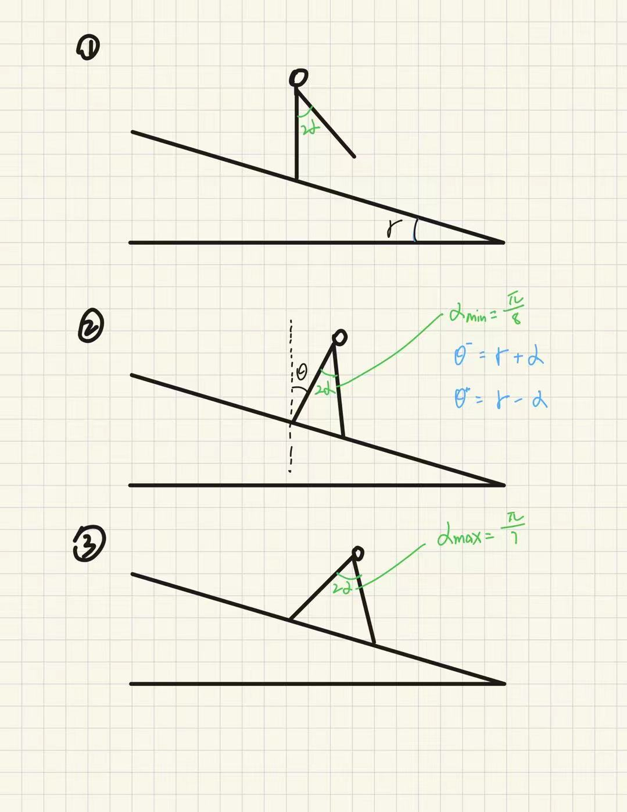
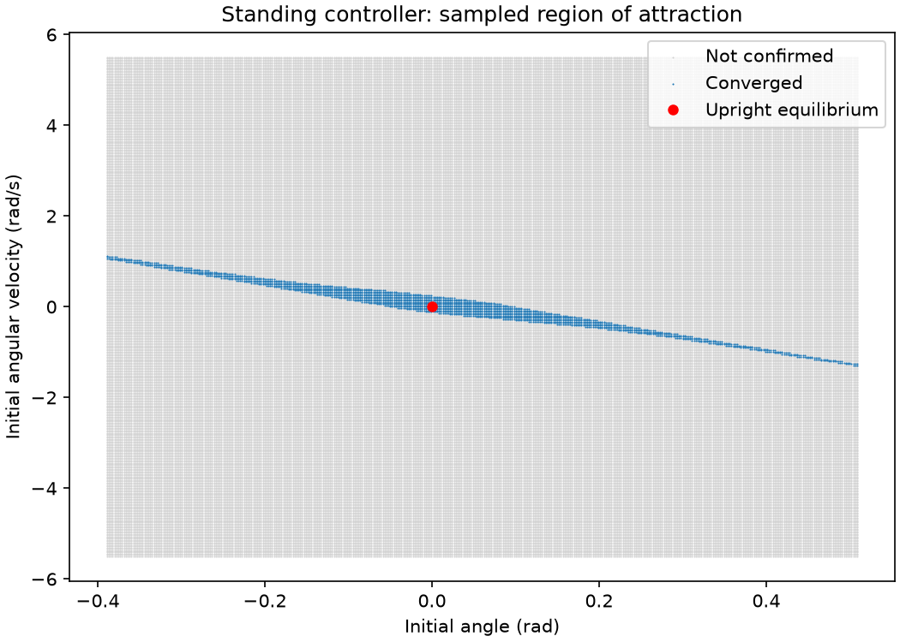
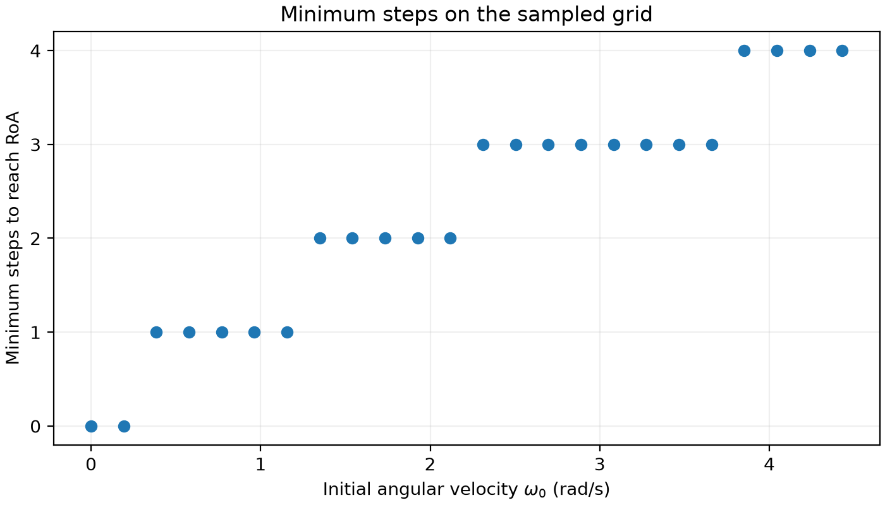
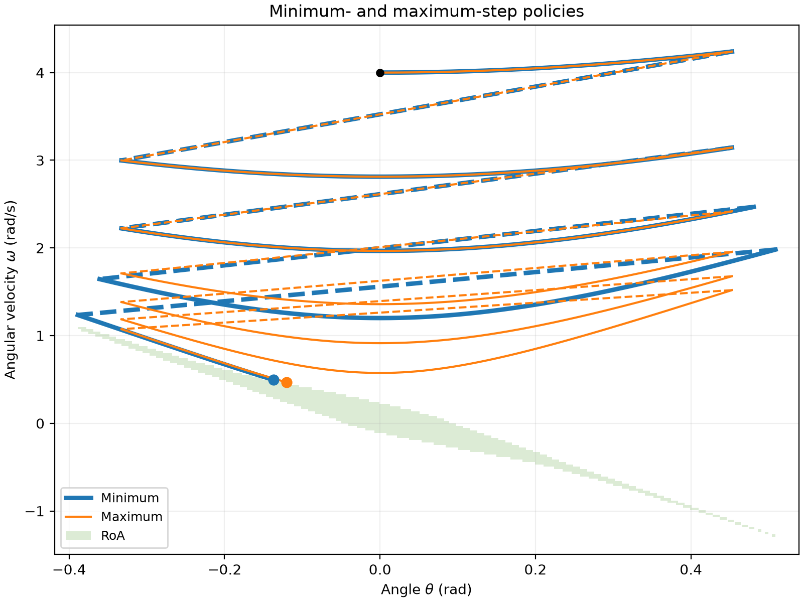

# Assignment 2: Controlled Inverted Pendulum Walker

```bash
# Plot the balancing RoA
uv run python assignments/assignment_2/analyze_balance_roa.py
# Build the transition table and plot minimum step counts
uv run python assignments/assignment_2/poincare_map.py
# Compare minimum- and maximum-step trajectories
uv run python assignments/assignment_2/simulate_policy.py
```

Results are saved in `output/`.

## Model and balancing controller



I used $m=1$ kg, $\ell=1$ m, $g=9.81$ m/s$^2$, and slope $\gamma=0.06$ rad.
The stance angle $\theta$ is measured clockwise from upward vertical, and
$\alpha\in[\pi/8,\pi/7]$ is half the angle between the legs.

$$
\dot\theta=\omega,\qquad
\dot\omega=\frac{g}{\ell}\sin\theta+\frac{\tau}{m\ell^2}.
$$

Contact occurs at $\theta^-=\gamma+\alpha$, followed by the reset

$$
\theta^+=\gamma-\alpha,\qquad
\omega^+=\omega^-\cos(2\alpha).
$$

The balancing controller cancels gravity and adds restoring feedback:

$$
\tau=\mathrm{clip}\!\left(
-mg\ell\sin\theta-m\ell^2(k_p\theta+k_d\omega),
-0.1mg\ell,\;0.05mg\ell
\right),
$$

with $k_p=1\,\mathrm{s}^{-2}$ and $k_d=2\,\mathrm{s}^{-1}$. Without saturation, the closed-loop dynamics
are $\ddot\theta+k_d\dot\theta+k_p\theta=0$, which stabilizes upright standing.

## Region of attraction

I simulated fixed-foot balancing on a $401\times401$ grid covering
$\theta\in[\gamma-\pi/7,\gamma+\pi/7]$ and $\omega\in[-5.5,5.5]$ rad/s.
Using forward Euler with a 0.001 s timestep for 30 s, I classified a state as
convergent if it avoided ground contact and ended with
$|\theta|<0.001$ rad and $|\omega|<0.001$ rad/s; 2,619 states met these criteria.



The narrow, downward-sloping band reflects the limited torque: a lean can be
recovered when angular velocity carries the walker back toward upright.
For walking, I accepted entry only into cells whose four corners converged.
Ankle torque remains zero outside this estimated RoA, and the walking rollout
ends at entry.

## Poincaré section and step policy

I chose the section

$$
\Sigma=\{(\theta,\omega):\theta=0,\;\omega>0\},\qquad
\omega_{k+1}=P(\omega_k,\alpha_k).
$$

It is transverse because $\dot\theta=\omega>0$, and its angle is independent
of $\alpha$, so only angular velocity needs gridding.

I sampled 24 velocities from 0 to $\sqrt{2g/\ell}=4.429447$ rad/s and three
landing angles: $22.5^\circ$, $24.107143^\circ$, and $25.714286^\circ$.
Each angle was held for one step. Return simulations used forward Euler with
$\Delta t=10^{-4}$ s, an 8 s limit, and linear interpolation at section crossings.

Starting from transitions that enter the RoA directly, I worked backward to
find minimum step counts. All nonterminal returns mapped to lower-speed grid
points, allowing maximum counts to be computed in ascending velocity order.
During rollouts, the nearest grid point selected the action; integration used
the actual state.

The table gives the next section velocity (rad/s) for each landing angle and
the resulting minimum/maximum step-count estimates. **Initial** means already
inside the RoA; **RoA** means entry before the next return.

| $\omega_k$ (rad/s) | $\alpha=22.50^\circ$ | $\alpha=24.11^\circ$ | $\alpha=25.71^\circ$ | Min. steps | Max. steps |
| ---: | ---: | ---: | ---: | ---: | ---: |
| 0.0000 | Initial | Initial | Initial | 0 | 0 |
| 0.1926 | Initial | Initial | Initial | 0 | 0 |
| 0.3852 | RoA | RoA | — | 1 | 1 |
| 0.5778 | RoA | RoA | — | 1 | 1 |
| 0.7703 | 0.4571 | RoA | RoA | 1 | 2 |
| 0.9629 | 0.6130 | 0.3689 | RoA | 1 | 2 |
| 1.1555 | 0.7614 | 0.5637 | RoA | 1 | 3 |
| 1.3481 | 0.9060 | 0.7292 | 0.4563 | 2 | 3 |
| 1.5407 | 1.0482 | 0.8823 | 0.6515 | 2 | 3 |
| 1.7333 | 1.1890 | 1.0289 | 0.8183 | 2 | 4 |
| 1.9258 | 1.3291 | 1.1709 | 0.9712 | 2 | 4 |
| 2.1184 | 1.4684 | 1.3103 | 1.1162 | 2 | 4 |
| 2.3110 | 1.6071 | 1.4475 | 1.2562 | 3 | 4 |
| 2.5036 | 1.7454 | 1.5836 | 1.3921 | 3 | 5 |
| 2.6962 | 1.8832 | 1.7182 | 1.5254 | 3 | 5 |
| 2.8888 | 2.0209 | 1.8518 | 1.6570 | 3 | 5 |
| 3.0814 | 2.1586 | 1.9849 | 1.7868 | 3 | 5 |
| 3.2739 | 2.2959 | 2.1173 | 1.9153 | 3 | 5 |
| 3.4665 | 2.4331 | 2.2495 | 2.0428 | 3 | 6 |
| 3.6591 | 2.5702 | 2.3808 | 2.1693 | 3 | 6 |
| 3.8517 | 2.7072 | 2.5121 | 2.2953 | 4 | 6 |
| 4.0443 | 2.8441 | 2.6433 | 2.4208 | 4 | 6 |
| 4.2369 | 2.9810 | 2.7739 | 2.5454 | 4 | 6 |
| 4.4294 | 3.1179 | 2.9043 | 2.6698 | 4 | 6 |

## Grid resolution

My check was agreement between predicted and simulated minimum step counts,
with all settings except velocity resolution held fixed and $\theta_0=0$.

| Grid points | Spacing (rad/s) | $\omega_0$ (rad/s) | Predicted | Simulated |
| --- | --- | --- | --- | --- |
| 12 | 0.402677 | 2.818739 | 3 | 4 |
| 24 | 0.192585 | 2.818739 | 3 | 3 |
| 24 | 0.192585 | 4.000000 | 4 | 4 |

With 12 points, step 3 began at $\omega=1.361507$ rad/s but used the action
for 1.208031 rad/s. It missed the RoA and required another step. I therefore
used 24 points, which matched both tested rollouts; these checks do not
establish the coarsest sufficient grid over all initial states.

## Results



The estimated minimum count increases in bands from 0 to 4 steps over the
sampled range. Zero-step states already lie inside the RoA.



From $(\theta_0,\omega_0)=(0,4)$, the sampled minimum-step policy enters the RoA
after **4 impacts**, using $\alpha=22.5^\circ,22.5^\circ,24.107143^\circ,25.714286^\circ$.
The maximum-step policy uses $22.5^\circ$ throughout and enters after **6 impacts**.
The larger final angles in the minimum-step policy reduce the impact velocity
multiplier $\cos(2\alpha)$.

Solid curves show continuous motion; dashed links show instantaneous impact
resets.
